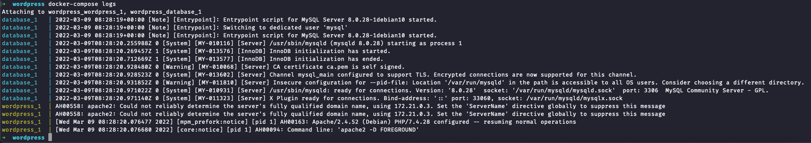
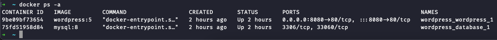

# WordPress 踩坑记

折腾过很久的 WordPress，最早搞了个腾讯云学生机，买了个域名搞备案，然后直接在物理机上装 PHP 和 WordPress，最后的结果就是寄了，页面巨卡，配置各种出错。

现在开始重新搞 WordPress，使用 Docker 来部署，比直接在物理机上装要简单不少，但还是踩了不少坑。

## 准备
1. 你需要一台服务器
2. 你需要一个域名
3. 如果你的域名和服务器在国内，那么你需要进行 ICP 备案

### 服务器
服务器的选择有很多，我使用的是腾讯云轻量应用服务器，毕竟负载不高，轻量应用服务器也便宜，足够使用了。当然，你也可以选择别的服务器。服务器运行 Debian 11 系统，其他的 Linux 发行版也可以。

你需要安装这些东西：

1. `Docker` 参照 [Docker 官方文档](https://docs.docker.com/engine/install/) 来就行，如果服务器在国内，可能会访问不了 Docker 的官方仓库，可以参考 [中国科学技术大学 Docker-CE 源使用帮助](https://mirrors.ustc.edu.cn/help/docker-ce.html) 来安装。
2. `Docker Compose` 参照 [Docker 官方文档](https://docs.docker.com/compose/install/) 来，Docker Compose 的内容托管在 GitHub，服务器在国内时可能会访问困难，参照 [这个](https://get.daocloud.io/#install-docker) 教程安装
3.  `Nginx` 用作反向代理，添加 SSL 证书，直接用包管理器安装即可，你可以选择 `nginx` 或者 `nginx-full` 包

服务器需要开通 80 端口和 443 端口（如果你需要配置 SSL 证书的话）

### 域名
域名要买很简单，但是需要注意：
1. 如果你的服务器在国内，那么你需要在国内的代理机构注册域名，腾讯云的服务器就在腾讯云 DNSPod 注册，阿里云就在阿里万网注册，注册好之后需要进行备案，具体看云服务商的文档
2. 如果你的服务器在国外，那么无所谓，我的这个域名在 NameCheap 注册，你也可以去 GoDaddy 之类的网站去注册

有了域名之后，挑个子域解析到服务器就好，之后就从这个子域访问 WordPress 站点。

## 启动 WordPress
为了避免各种权限问题，服务器上直接在 Home 目录创建一个文件夹用于存放 WordPress 数据，例如 `~/wordpress` 路径，在文件夹中创建一个 `docker-compose.yaml` 文件，写入以下内容：

version: '3'

services:

  database:
    image: mysql:8
    restart: always
    environment:
      MYSQL_DATABASE: 数据库名
      MYSQL_USER: 数据库用户名
      MYSQL_PASSWORD: 数据库密码
      MYSQL_RANDOM_ROOT_PASSWORD: 'yes'
    volumes:
      - ./mysql:/var/lib/mysql

  wordpress:
    image: wordpress:5
    restart: always
    ports:
      - 8080:80
    environment:
      WORDPRESS_DB_HOST: database
      WORDPRESS_DB_USER: 数据库用户名
      WORDPRESS_DB_PASSWORD: 数据库密码
      WORDPRESS_DB_NAME: 数据库名
    volumes:
      - ./wordpress:/var/www/html
      - ./php/uploads.ini:/usr/local/etc/php/conf.d/uploads.ini

把 `数据库名` `数据库用户名` `数据库密码` 替换掉。

在 WordPress 数据文件夹中创建一个 `php` 文件夹，在里面创建 `uploads.ini` 文件并写入以下内容：

memory_limit = 256M
post_max_size = 32M
upload_max_filesize = 100M
file_uploads = On
max_execution_time = 600
max_input_time = 600

这里的 `upload_max_filesize` 是允许上传文件大小上限，100M 基本足够使用了。

在 WordPress 数据文件夹下运行命令启动 WordPress 和 MySql 数据库：

docker-compose up -d

在启动前，会从 Docker Hub 拉取 `wordpress:5` 和 `mysql:8` 镜像，如果服务器在国内导致拉取速度特别慢，可以按照 [中国科学技术大学 Docker Hub 源使用帮助](http://mirrors.ustc.edu.cn/help/dockerhub.html) 来配置使用镜像站。

> 所有 Docker Compose 指令需要在有 `docker-compose.yaml` 的文件夹中执行

查看状态：

docker-compose logs

或者

docker ps -a

## 配置 Nginx
运行 Docker Container 后，WordPress 会运行在本地的 8080 端口，使用 Nginx 将 WordPress 转发出去。

创建 `/etc/nginx/site-available/wordpress.conf` 文件，写入以下内容：

server{
    listen 80;
    server_name 你的域名;

    client_max_body_size 100M;

    location / {
        proxy_set_header X-Forwarded-For $proxy_add_x_forwarded_for;
        proxy_set_header Host $http_host;
        proxy_set_header X-Forwarded-Proto https;
        proxy_redirect off;
        proxy_http_version 1.1;
        proxy_pass http://127.0.0.1:8080;
    }
}

记得把 `你的域名` 这里给替换掉。

这个配置文件不包含 HTTPS 的配置内容，要开启 HTTPS，可以用 Let’s Encrypt 的证书，或者通过 Cloudflare 获取，但是国内的备案域名不能使用 Cloudflare 获取。

- 如果使用 Let‘s Encrypt 获取，参考 [官方文档](https://letsencrypt.org/zh-cn/getting-started/)
- 如果使用 Cloudflare 获取，把域添加进 Cloudflare 然后使用 Cloudflare DNS 解析到你的服务器，并开启代理即可
- 除此之外，你还可以通过云服务商获取免费的 SSL 证书，比如 [腾讯云](https://cloud.tencent.com/product/ssl)，或者 [阿里云](https://www.aliyun.com/product/cas) 等，都有免费的 SSL 证书，参考云服务商的文档安装到 Nginx 即可

## 后续
- 主题有很多可以选的，我使用的是 `Sakurairo` [GitHub](https://github.com/mirai-mamori/Sakurairo) [主题周边站](https://iro.tw/) [作者的博客](https://asuhe.jp/)
- 如果要配置 WordPress 的邮件系统，最简单的选择就是直接用 Outlook 或者 GMail 之类的发送邮件，如果要用自己的域，自建 SMTP 很麻烦，可以使用 [Sendinblue](https://www.sendinblue.com/) 之类的工具

## 结语
有了 Docker 和 Docker Compose 之后，部署 WordPress 等软件都省力了不少，不用去折腾繁琐的 PHP 配件了。φ(゜▽゜\*)♪