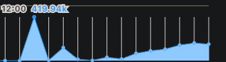
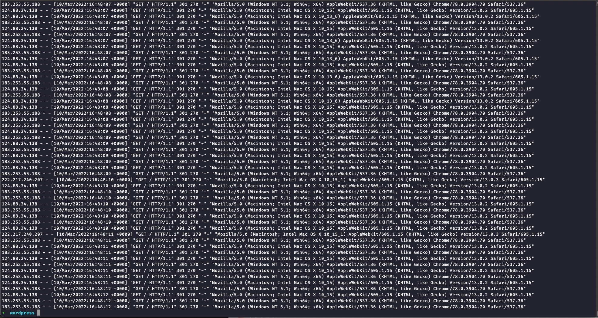
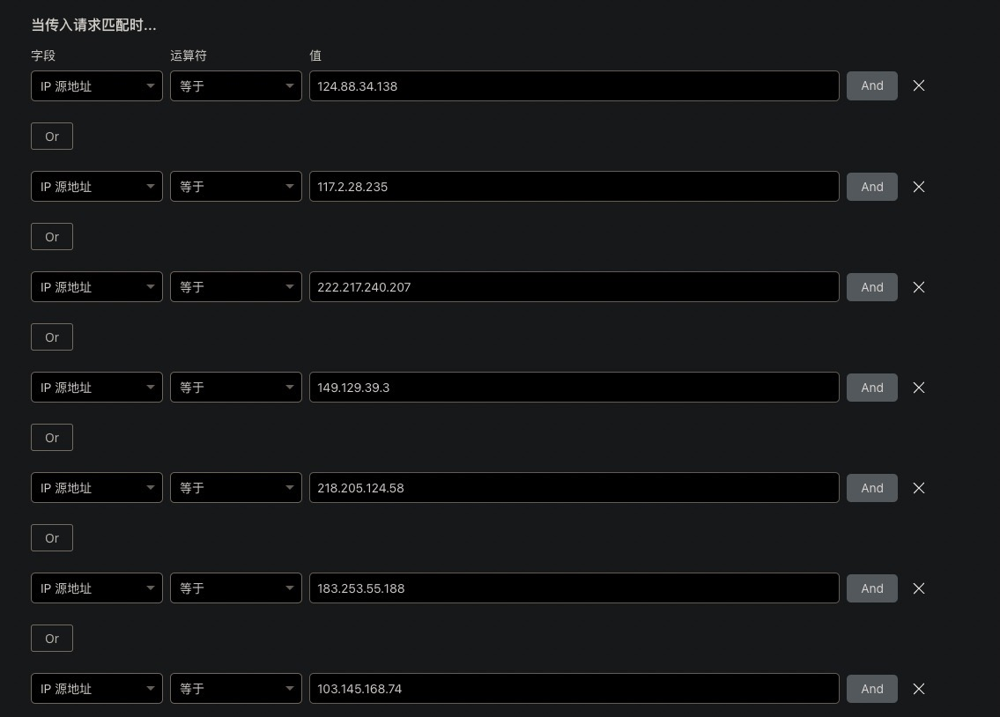
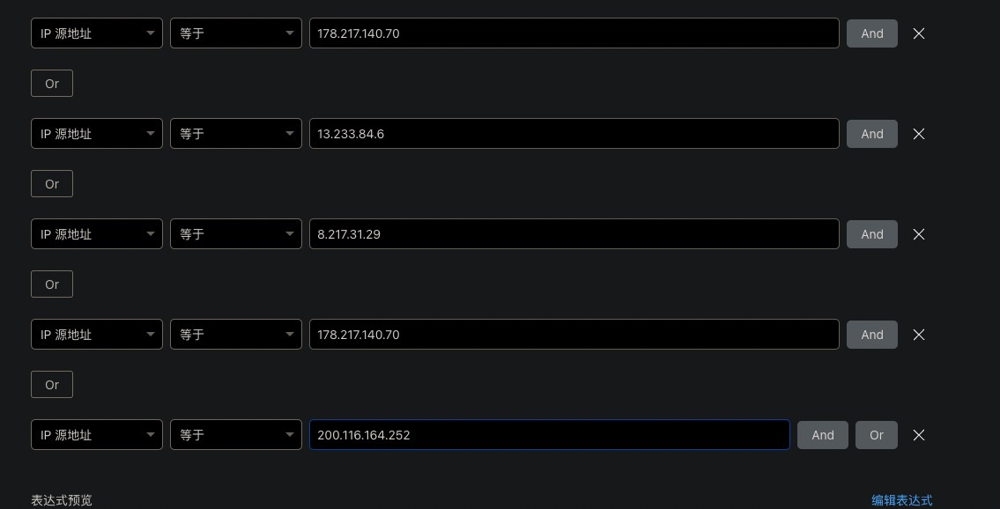
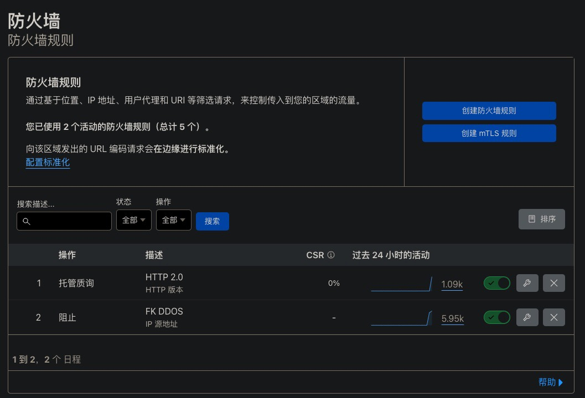
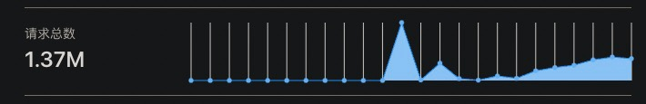
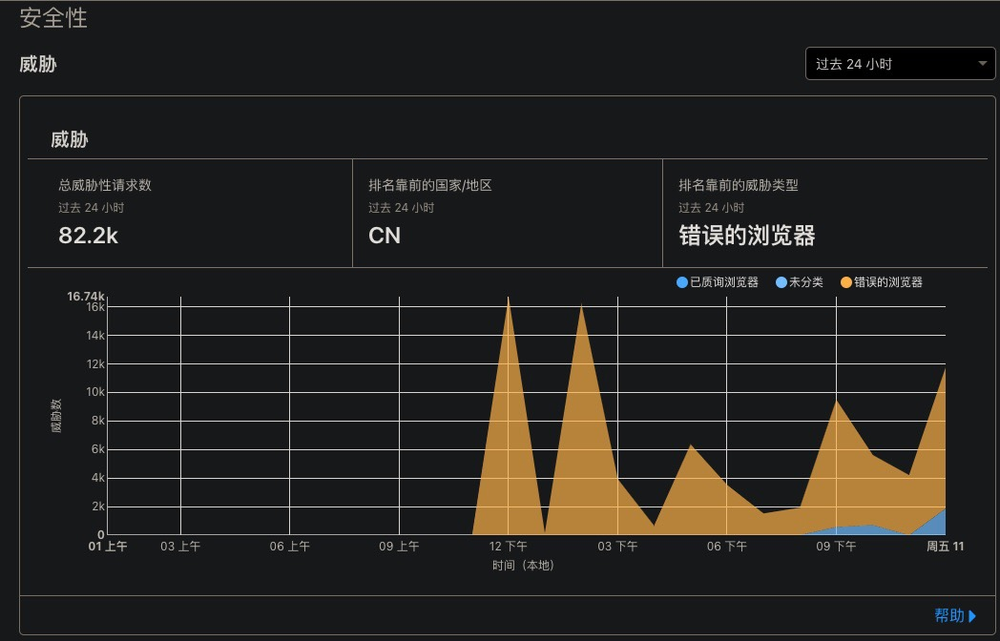

# 记录一次被 DDOS 的经历

真没想到，这个站点运行还不满一天的时候就被 DDOS 了。。。

## 2022.3.10 下午

10号正午12:00的时候，Cloudflare 记录到了总计 419.94 K 个请求。

然而这个时候我并没有发现。过了两个小时，又有大概 100K 个请求发了过来。

直到下午 16:00 左右，我访问了一次博客，然后发现直接就报了 523 错误，说明 Cloudflare 无法联系源站，所以我连上了服务器的 SSH，重启了一下 Docker 容器，心想是不是什么东西设置有问题，手头没空，待会儿再去修。

## 2022.3.10 晚上

我再次访问博客，发现又炸了，开始觉得纳闷，于是连上服务器的 SSH 去看看咋回事，但是死活连不上。但是这时候发现，WordPress 显示数据库连接不上，用腾讯云网页 VNC 连接服务器去查看，发现提示 OOM 然后直接把 mysqld 给干掉了。难怪连不上数据库。

所以我直接重启了机器，我在想的是 MySql 是不是出了什么 Bug，怎么好端端得，直接把内存炸了。重启之后，由于配置了 Docker Container 开机后自动运行，所以我赶紧 SSH 连上去，把容器停掉，然后只开 MySql，去把数据全部 dump 出来。

我以为是 MySql 有什么 Bug，所以直接把数据库换成了开源的 MariaDB，但是问题依旧，开机后不过几分钟又 OOM 了，然后把数据库给干掉了。

去翻了翻 Docker 的官方文档，改了改 Docker Compose 文件，为了防止 OOM 直接把系统炸掉，我给 WordPress 和 MariaDB 容器加上内存限制。过了一会儿发现，数据库没问题，WordPress 容器炸了。

## 2022.3.11 凌晨

凌晨了。

被干掉的进程是数据库，然而炸了的是 WordPress，开来一开始找的方向就找错了。由于限制了容器可使用的内存，保证不会直接把系统内存给炸了。

看了看 WordPress 容器日志，看到了下面这种恐怖的画面：

PS. 服务器时间设置有错，所以图上的时间不是北京时间，而是 GMT+0 时区时间

WordPress 的 Docker 镜像是打包了个 Apache 进去的，请求太多直接给 Apache 干炸了。

第一次应对，不知道什么好的方法，开启 Cloudflare 的 Under Attack 模式，再直接把这些 IP 加进 Cloudflare 的防火墙黑名单，2 分钟左右就拦下了 5 K 个请求。大概抓了半个小时，把攻击 IP 给抓干净了。

然后就是开启了非 HTTP/2 的质询，大部分攻击源都是 HTTP/1.1 协议的。

查看了一下 Cloudflare 数据统计，被直接判定为威胁的数量远不及实际请求数量，看来这些攻击者的伪装比较厉害。

## 结语

也不知为啥我的这个服务器会被攻击，估计是现在局势比较动荡，有谁在进行无差别的攻击。如果你也有网站在运营，建议多多关注一下安全性，开启至少 TLS 1.2 和非 HTTP/2 需要质询之类的，能够在很大的程度上拦下攻击者。
